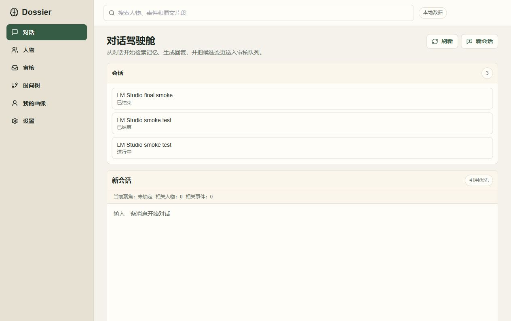
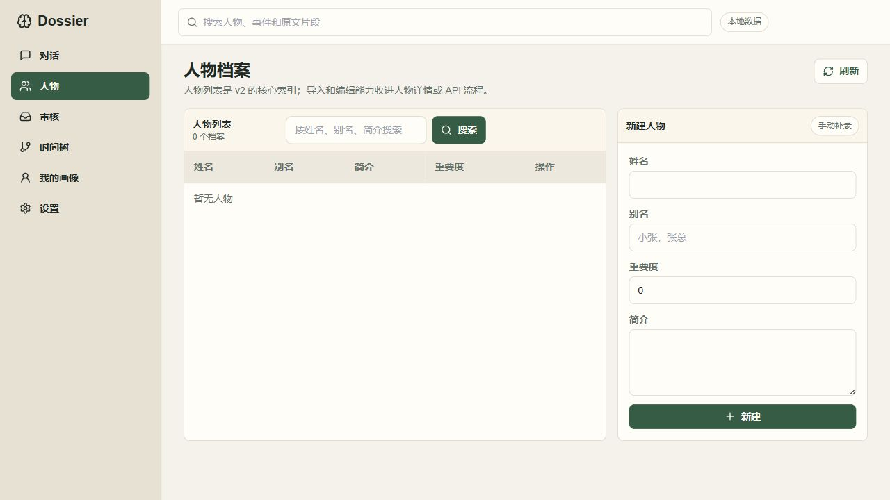
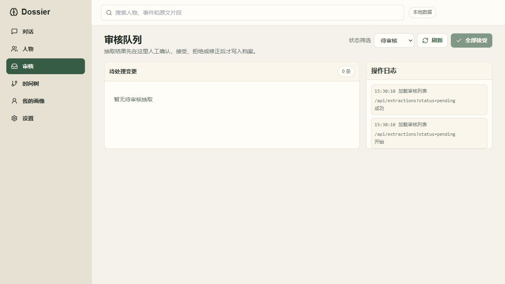
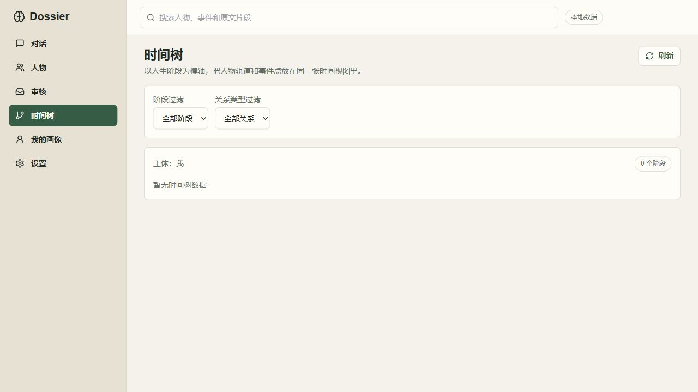
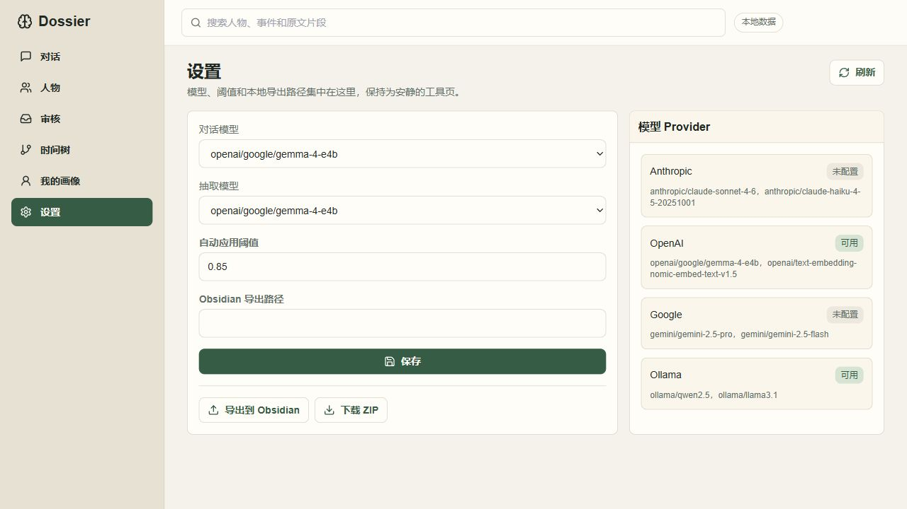

# Dossier

Dossier 是一个本地优先的人际关系档案系统，用来沉淀人物、事件、事实、偏好和沟通上下文。当前实现是 **v1 数据/API 底座 + v2 WebUI 表层**：主界面收敛到 Chat、People、Inbox、Timeline、Self、Settings。

## Quickstart

```bash
git clone https://github.com/UntR/Dossier.git dossier
cd dossier && npm install
npm start
```

有 Docker 时，`npm start` 会优先用 Docker Compose 启动；否则会使用本地 `.venv`。默认地址：

- Frontend: `http://localhost:3000`
- Backend API docs: `http://localhost:8000/docs`

## LM Studio

Dossier 通过 OpenAI-compatible 接口连接 LM Studio。Docker 部署时，宿主机上的 LM Studio API 通常这样配置：

```env
OPENAI_API_KEY=lm-studio
OPENAI_API_BASE=http://host.docker.internal:1234/v1
```

改完 `.env` 后重新运行 `npm start`，再到 Settings 里选择聊天模型和抽取模型。

## Screenshots

### Chat



### People



### Inbox



### Timeline



### Settings



## Common Commands

```bash
npm start
npm stop
npm run build
npm run test:e2e
.venv/bin/python -m pytest backend/tests -q
scripts/install-mcp.sh --write-claude-config
scripts/install-backup-cron.sh --dry-run
```

## Troubleshooting

### 路径校验失败

在仓库根目录运行 `pwd`，确认 `.env`、`data/`、`backend/`、`frontend/`、`mcp/` 在同一层。如果 SQLite 路径不对，删除 `.env` 里错误的 `DATABASE_URL` 覆盖项，然后重新运行 `npm start`。

### API key 不识别

Provider key 从 `.env` 或环境变量读取：`ANTHROPIC_API_KEY`、`OPENAI_API_KEY`、`GOOGLE_API_KEY`。LM Studio 使用 OpenAI-compatible 配置时，还需要设置 `OPENAI_API_BASE`。修改 `.env` 后重启 `npm start`。

### MCP 装不上

先运行 `npm install`，确保 `.venv` 和 MCP 依赖已安装，然后运行：

```bash
scripts/install-mcp.sh --write-claude-config
```

写入配置后重启 Claude Desktop。如果工具仍未出现，直接验证 stdio：

```bash
.venv/bin/python scripts/verify-mcp-stdio.py
```
